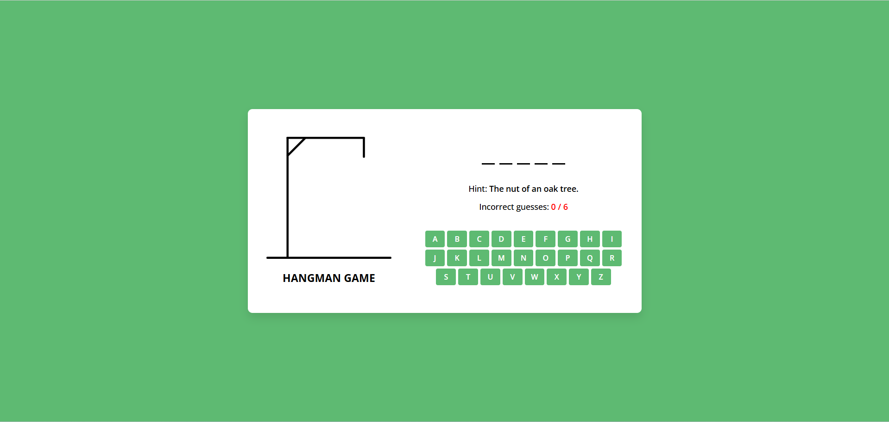

# Name of the game
Hangman

# How to play ?
Is a word guessing game. Computer thinks of a word, the player guesses it by choosing letters from the alphabet.
There are certain amount of guesses after player guesses the word, they win.
If player used all guesses and still not guessed the word, they lose.

# Getting started
Project link : https://trainhartnett.github.io/Hangman/

# Screen Shot

# Attributions: Images
https://drive.google.com/drive/folders/1S5bt-CPdsLbUq1LNh-zIGXbelKk4MpmQ

# Technologies Used:
JavaScript, HTML, CSS, Images.

# Next steps:
 I will try to add sound to make the game to make it more attractive and interactive

User Stories:

1. As a player, I want to know the game and instructions, so that I understand how to play the game.

2. As a player, I want to click on boxes to select, so that I can enter/guess a letter of the hidden word.

3. As a player, I want see visual feedback after guessing a letter, so that I know whether I've guess right or not.

4. As a player, I want see the life of hangman being built as I guess letters correctly, so that I have a goal to accomplish and a reason to win.

5. As a player, I want an option to play again, so that I can guess a different word.

//Game Flow Pseudocode

To start the Hangman game, display the game title and instructions to the player.
Randomly select a hidden word from a predefined list.
Show the player blank spaces representing each letter in the word.
Present clickable letter boxes for the player to choose from.
When the player clicks a letter, check if the letter is in the hidden word.
If the guess is correct, reveal the letter in all its positions and provide positive feedback.
If the guess is incorrect, visually update the hangman drawing to show a new part and provide negative feedback.
Continue this process until the player either guesses all the letters correctly (winning the game) or the hangman drawing is completed (losing the game).
After the game ends, display a message indicating whether the player won or lost, reveal the correct word if necessary, and offer an option to play again with a new game.